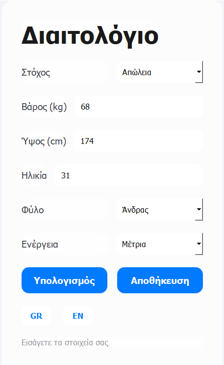
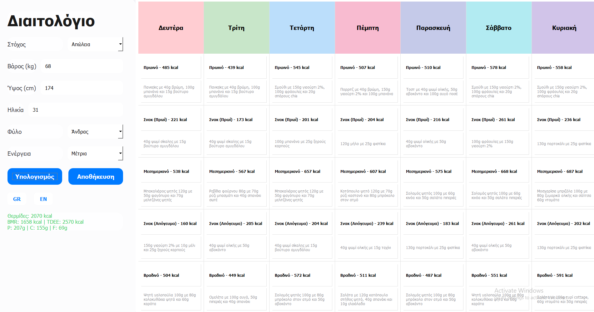

# DietApp

A modern diet planning application built with Python and PyQt6.

## Description

DietApp is a user-friendly tool designed to create personalized weekly meal plans based on individual data such as weight, height, age, gender, activity level, and fitness goals. It supports both Greek and English languages and allows users to export their meal plans as JPEG images. The application features a sleek, Apple-inspired UI with a blurred background, making it both functional and visually appealing.

## Features

- **Personalized Input**: Enter weight, height, age, gender, and activity level to calculate nutritional needs.
- **Nutrition Calculations**: Computes Basal Metabolic Rate (BMR), Total Daily Energy Expenditure (TDEE), and macronutrient goals (protein, carbs, fats).
- **Weekly Meal Plans**: Generates realistic meal suggestions for breakfast, lunch, dinner, and snacks across seven days.
- **Multilingual Support**: Available in Greek and English with seamless language switching.
- **Export Functionality**: Save your meal plan as a JPEG file for easy sharing or printing.
- **Modern UI**: Flat design with a glossy, blurred background inspired by Apple's aesthetic.
- **Standalone Executable**: Can be compiled into a single .exe file for easy distribution.

## 📸 Screenshots

